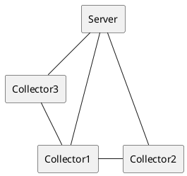

# Installation Guide
Requirements: OpenJDK-18

# How to run the software

Collectors: Collects hardware-information of an edge node. Each node requires one collector.

Configuration-Creator: Calculates and slices valid configurations.

Configuration-Manager: Aggregates hardware-information from each collectors and builds a graph based on valid configurations.

JMH: Benchmarks

The software contains of two parts. The server, that runs only once and is responsible for the orchestration of the tasks. In addition, there are $`n`$ many collectors, which gather the data the QoR-Manager needs to decide. 

The organisation might look like:

## Server
To start the server you can run it with the following options.

<-s> [-p &lt;port&gt;]

## Collector
To start a collector you can run it with the following options.

<-c> [-p &lt;server port&gt;] [-i &lt;server ip address&gt;]
